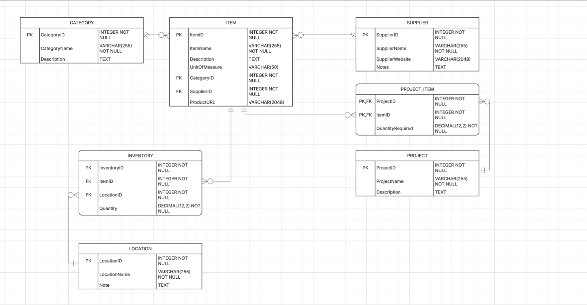

# WDP Project - Workshop Inventory Management System

## Description

My project will be a workshop inventory management tool. I have a lot of consumables in my workshop that are difficult to keep track of, so I would like to create a system to manage them.

The system will store information about items such as hardware, chemicals, electrical components, and other workshop consumables. It will also keep track of where items are stored, how much inventory is available, suppliers, and which items are needed for different projects.

## Purpose

The purpose of this project is to make it easier to keep track of workshop supplies and determine:

- What items are currently available
- How much of each item is in stock
- Where each item is stored
- Where an item was purchased
- Which items are needed for a project

## Intended Audience

The primary user of this application is a home workshop owner who needs to organize and track a large number of consumable supplies.

The system could also be useful for hobbyists, makers, or small workshops that need a simple inventory management system.

## Features

Users will be able to:

- Add and manage inventory items
- Organize items into categories
- Track the quantity of each item
- Track where items are stored
- Associate items with suppliers
- Store direct product links for commonly purchased items
- Create projects
- Associate multiple inventory items with a project
- Specify the quantity of an item required for a project

## Entity Relationship Diagram

The ERD below shows the entities, attributes, relationships, and cardinalities used by the system.

## Business Rules

1. A category may contain zero or many items. Each item must belong to exactly one category.

2. An item may have zero or many inventory records. Each inventory record must reference exactly one item.

3. A location may contain zero or many inventory records. Each inventory record must reference exactly one location.

4. A supplier may supply zero or many items. Each item must reference exactly one supplier.

5. A project may contain zero or many project-item records. Each project-item record must reference exactly one project.

6. An item may appear in zero or many project-item records. Each project-item record must reference exactly one item.

## Main Entities

The database contains the following entities:

- **Category** - Organizes similar inventory items.
- **Item** - Stores information about individual workshop consumables.
- **Inventory** - Tracks the quantity and location of an item.
- **Location** - Represents a physical storage location in the workshop.
- **Supplier** - Stores information about vendors that supply items.
- **Project** - Represents a workshop project.
- **Project_Item** - Associates items with projects and stores the quantity required.